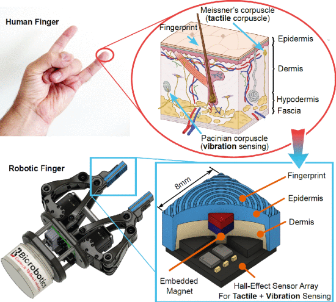

 "

This work presents a novel biomimetic tactile sensor designed to emulate biological sensory mechanisms for enhanced material classification capabilities. The research addresses the challenge of enabling robots to distinguish between different materials through tactile sensing, a fundamental capability for advanced manipulation tasks.

**Biomimetic Design Principles:**
The sensor design draws inspiration from biological tactile systems, incorporating features that mirror the structure and function of natural mechanoreceptors. This biomimetic approach aims to capture the sophisticated sensing capabilities observed in biological systems, where multiple types of receptors work together to provide rich tactile information.

**Material Classification Framework:**
The sensor system is specifically engineered for material classification tasks, enabling robots to distinguish between different surface properties, textures, and material types through direct tactile contact. This capability is essential for applications requiring material identification and sorting without visual cues.

**Key Technical Contributions:**
- Novel biomimetic sensor architecture inspired by biological mechanoreceptor systems
- Integrated approach combining hardware design with signal processing for material classification
- Experimental validation demonstrating improved material discrimination performance
- Framework suitable for integration into robotic manipulation systems

**Applications and Impact:**
The developed sensor has significant implications for robotic applications requiring material identification, including:
- Automated sorting and recycling systems
- Quality control in manufacturing processes
- Assistive robotics for material handling
- Exploration robotics in environments with limited visibility

**Collaborative Research:**
This interdisciplinary work represents collaboration between multiple research groups at Carnegie Mellon University, combining expertise in robotics, biomimetics, and sensor design. The research bridges biological inspiration with practical engineering implementation for real-world robotic applications.

The sensor's biomimetic design approach represents an important step toward developing tactile sensing systems that approach the sophistication and versatility of biological touch perception, enabling more capable and adaptive robotic systems for complex manipulation tasks.